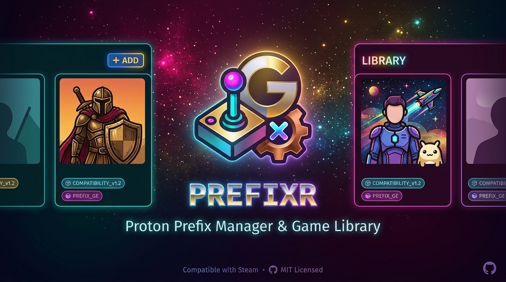

<div align="center">
  <h1>Prefixr</h1>

  <p>
    A native Linux app for managing Wine and Proton prefixes to run Windows games
  </p>

  

  <p>Built with <a href="https://v2.tauri.app/">Tauri 2</a>, <a href="https://kit.svelte.dev/">SvelteKit</a> and Rust.</p>

  <p>
    <a href="#requirements"></a>
    <a href="https://v2.tauri.app/"></a>
    <a href="https://kit.svelte.dev/"></a>
    <a href="https://www.rust-lang.org/"></a>
    <a href="#license"></a>
  </p>
</div>

---

## Table of Contents

- [What is Prefixr?](#what-is-prefixr)
- [✨ Features](#features)
- [✅ Requirements](#requirements)
- [📦 Installation](#installation)
- [🛠️ Development](#development)
- [🧰 Troubleshooting](#troubleshooting)
- [License](#license)

## What is Prefixr?

Prefixr is a library for Windows games on Linux: add games, create or reuse Wine/Proton prefixes for them, download matching runners, and configure per game how it's launched — including graphics overlays, performance tweaks and Steam artwork. Everything runs in a native desktop UI instead of the terminal.

## 🚀 Quick Start

1. Install dependencies from [Requirements](#requirements).
2. Install frontend packages with Bun.
3. Start the app in development mode:

```bash
bun install
bun run tauri dev
```

For a release binary/AppImage, see [Release build](#release-build).

## ✨ Features

**Game library**
- Add games via file dialog or the file manager's context menu; installers are detected automatically
- Search, sort, per-game launch arguments and environment variables
- Game icons are extracted from embedded `.exe` resources and stored/displayed as PNG
- Create desktop and menu shortcuts

**Prefixes & runners**
- Create your own Wine/Proton prefixes or import existing ones (including from Steam)
- Download Proton-GE, Wine (Kron4ek) and Proton-CachyOS runners directly from GitHub releases, with checksum verification
- Launch via [umu-launcher](https://github.com/Open-Wine-Components/umu-launcher) (managed by Prefixr and installable from the UI), including automatic GAMEID lookup from the umu database for [protonfixes](https://github.com/Open-Wine-Components/umu-protonfixes)
- Proton environment toggles (HDR, Wayland, NVAPI, sync mode, shader cache, …) are read directly from the selected runner's `proton` script — only what that runner actually supports is offered
- Winetricks integration for installing Windows dependencies
- Launch Wine tools (winecfg, regedit & co.) directly from the UI

**Graphics & performance**
- Per-game: MangoHud (with custom presets), GameMode, Gamescope, vkBasalt
- Manage DXVK/VKD3D and additional Direct3D layers
- `max_map_count` check and fix for games that need a higher value

**Steam & artwork**
- Search and assign cover, icon, hero and logo images via [SteamGridDB](https://www.steamgriddb.com/)
- Export games as a non-Steam game, including the chosen artwork, update and remove them again (`shortcuts.vdf`)
- Launching via Steam runs alongside an open Prefixr instance and without its own window

**Other**
- System tray with an overview of running games and safe shutdown when games are open
- Log viewer per game and per prefix (last 10 runs)
- GitHub token management to avoid API rate limits on runner downloads
- Bilingual UI (German/English) with instant language switching

## ✅ Requirements

Prefixr is built for **Linux** (tested on Bazzite/Fedora, among others). It also requires:

- [Wine](https://www.winehq.org/) or Steam's Proton prerequisites
- Recommended: [umu-launcher](https://github.com/Open-Wine-Components/umu-launcher) for Proton launches (Prefixr can install/update it from the app)
- Optional: Steam (for prefix import and export as a non-Steam game), [MangoHud](https://github.com/flightlessmango/MangoHud), [GameMode](https://github.com/FeralInteractive/gamemode), [Gamescope](https://github.com/ValveSoftware/gamescope), [vkBasalt](https://github.com/DadSchoolbus/vkBasalt)

## 📦 Installation

There are no prebuilt releases yet — Prefixr currently has to be built from source (see below). Once the AppImage is built, make it executable and run it as usual.

### 🏗️ Build from source

```bash
bun install
bun run tauri build
```

Artifacts (including AppImage) are written to:

```text
src-tauri/target/release/
```

## 🛠️ Development

### 🧩 Recommended setup

[VS Code](https://code.visualstudio.com/) + [Svelte](https://marketplace.visualstudio.com/items?itemName=svelte.svelte-vscode) + [Tauri](https://marketplace.visualstudio.com/items?itemName=tauri-apps.tauri-vscode) + [rust-analyzer](https://marketplace.visualstudio.com/items?itemName=rust-lang.rust-analyzer)

### 🦀 Rust/Tauri setup

Tauri requires Rust. Install it via rustup (Linux/macOS):

```bash
curl --proto '=https' --tlsv1.2 -sSf https://sh.rustup.rs | sh
source "$HOME/.cargo/env"
```

On Ubuntu/Debian you'll also need these system dependencies:

```bash
sudo apt update
sudo apt install libwebkit2gtk-4.1-dev build-essential curl wget file \
  libxdo-dev libssl-dev libayatana-appindicator3-dev librsvg2-dev
```

Verify the installation:

```bash
rustc --version
cargo --version
```

For other platforms (Windows, macOS) see [Tauri Prerequisites](https://v2.tauri.app/start/prerequisites/).

### 📚 Install frontend dependencies

Prefixr uses [Bun](https://bun.sh/) as its package manager:

```bash
bun install
```

### ▶️ Run in dev mode

```bash
bun run tauri dev
```

Starts the SvelteKit dev server and opens the Tauri window alongside it with hot reload.

### 📦 Release build

```bash
bun run tauri build
```

Builds the frontend and produces the native binary as well as the configured bundles (including an AppImage) under `src-tauri/target/release/`.

When downloading release assets, you may see two AppImage variants:

- `*-ubuntu-compat.AppImage`: built on Ubuntu (compatibility-focused baseline). Prefer this on most distros.
- `*-fedora-latest.AppImage`: built in a Fedora latest environment (newer userspace stack). Try this if the compatibility build crashes on very new Mesa/driver stacks.

Why both exist: AppImage bundles a large part of its own userspace libraries, so the build environment influences runtime behavior. Shipping both variants makes this tradeoff explicit: broad compatibility vs. newer graphics stack alignment.

### ✅ Type checking

```bash
bun run check
```

## 🧰 Troubleshooting

### ⚠️ AppImage crashes ("EGL_BAD_PARAMETER") or shows only a blank white window

**Symptom:** Launching the AppImage immediately produces

```
Could not create default EGL display: EGL_BAD_PARAMETER. Aborting...
```

or the window opens but stays completely white/blank. This occurred on a system with an AMD GPU on a very recent distro (Bazzite/Fedora 44, Mesa 26.2.2) — it did not occur on another PC with an NVIDIA GPU.

**Cause:** The AppImage bundles its own WebKitGTK version, current as of build time (from the Ubuntu 24.04 build container). This bundled version is incompatible with very recent Mesa/graphics driver versions on the target system. Neither `WEBKIT_DISABLE_DMABUF_RENDERER=1` nor `WEBKIT_DISABLE_COMPOSITING_MODE=1`, `GDK_BACKEND=x11` nor `LIBGL_ALWAYS_SOFTWARE=1` reliably fix this — at best they prevent the hard crash, but the window then stays white because rendering still doesn't actually work.

Confirmed by testing: the normally compiled binary (`src-tauri/target/release/prefixr`, **not** from the AppImage) automatically links against the host's system WebKitGTK instead of the bundled version, and renders completely normally on the same machine, without crashing.

**Workaround to try:** Instead of the AppImage, build and run the binary directly:

```bash
bun run tauri build   # NOT "cargo build --release" -- that doesn't embed
                       # the frontend assets, so the app then tries in vain
                       # to connect to the (not running) dev server
                       # ("Could not connect to localhost")
./src-tauri/target/release/prefixr
```

**Proper fix (still open):** Exclude the WebKitGTK/GTK bundling from the AppImage so it always uses the host's system libraries instead of shipping its own, potentially outdated copy. A test where only the bundled `libwebkit2gtk-4.1.so.0` was swapped for the system version failed due to a further ABI incompatibility with the also-bundled `glib` — so the bundle needs to be reworked as a whole rather than swapping out individual libraries.

**Side observation:** On crashing ("Aborting..."), the process sometimes lingers as a zombie and has to be killed manually (`kill -9`) instead of terminating cleanly.

### 🧹 Clearing the WebKit cache

On Linux, Tauri uses WebKitGTK as its webview. Its cache lives here:

```
~/.local/share/com.tristan.prefixr/WebKitCache/
```

Related locations in the same directory that also hold browser data:

- `CacheStorage/` — Cache API
- `storage/` — IndexedDB
- `localstorage/` — LocalStorage

Quit the app first (otherwise WebKit rewrites the files on exit), then:

```bash
rm -rf ~/.local/share/com.tristan.prefixr/WebKitCache
```

If you also want to reset LocalStorage/IndexedDB, delete `storage/` and `localstorage/` as well — careful, this also removes any app data stored there.

## License

MIT
