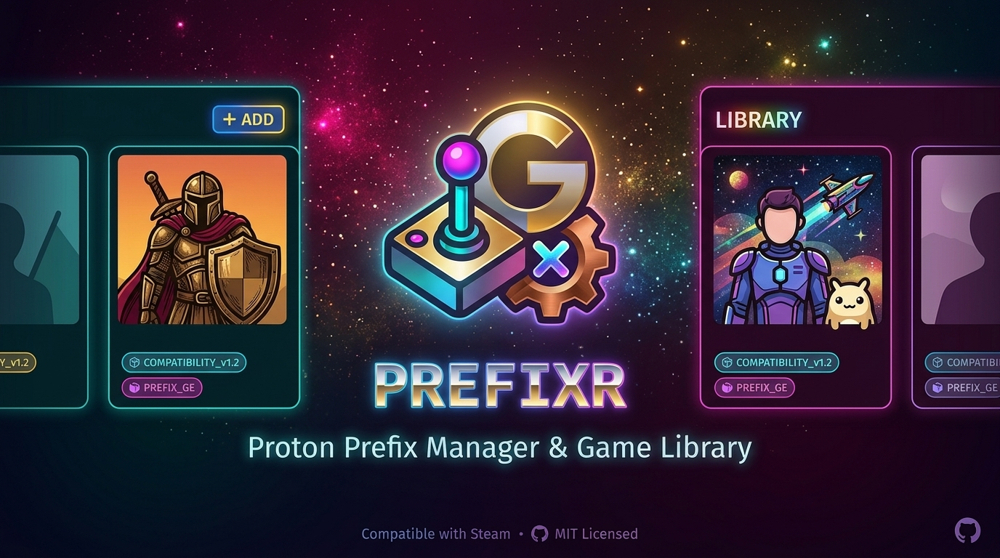

  <h1>Prefixr</h1>

  
<strong>Run Windows games on Linux with Wine and Proton, without the terminal.</strong>

  

    A native Linux game launcher that manages your Wine and Proton prefixes, downloads runners
    like Proton-GE, and sets up each game with MangoHud, Gamescope, GameMode and Steam artwork.
  

  

  

    
    
    
    
  

  

    <a href="#-installation"><strong>Install</strong></a> ·
    <a href="https://firsttris.github.io/prefixr/"><strong>Documentation</strong></a> ·
    <a href="docs/troubleshooting.md"><strong>Troubleshooting</strong></a> ·
    <a href="https://github.com/firsttris/prefixr/issues"><strong>Report a bug</strong></a>
  

---

## What is Prefixr?

Prefixr is a desktop app for playing **Windows games on Linux**. You add a game's `.exe`, pick a
**Wine or Proton prefix** and a **runner**, and Prefixr takes care of the rest: it creates the
prefix, launches the game through [umu-launcher](https://github.com/Open-Wine-Components/umu-launcher)
the way Steam launches Proton, applies [protonfixes](https://github.com/Open-Wine-Components/umu-protonfixes),
installs DXVK and VKD3D-Proton for plain Wine builds, and lets you tune every game on its own.

It is built for people who want their GOG, Epic, itch.io or standalone games next to their Steam
library, without editing launch scripts. If you know [Lutris](https://lutris.net/),
[Bottles](https://usebottles.com/), [Heroic](https://heroicgameslauncher.com/) or
[PortProton](https://linux-gaming.ru/), Prefixr covers the same ground with a focus on prefixes:
you can reuse an existing prefix from any of them as it is.

## ✨ Features

| | |
| --- | --- |
| 🎮 **Game library** | Grid and list views with search and sorting, icons extracted from each `.exe`, launch arguments and environment variables per game, desktop and app menu shortcuts. |
| 📦 **Installers** | Open a setup `.exe` with *Install Prefixr* from your file manager's *Open With* menu. The installer runs in the prefix you choose, and the shortcut it creates is offered as the game to add. |
| 🍷 **Prefixes** | Create new Wine/Proton prefixes or import existing ones from Steam, Lutris, Bottles or PortProton. Install dependencies with [winetricks](https://github.com/Winetricks/winetricks) and open `winecfg`, `regedit` and Wine's other tools from the app. |
| ⬇️ **Runners** | Download Proton-GE, Proton-CachyOS and Wine (Kron4ek) from their GitHub releases, checksum-verified. Any Proton or Wine build you place or symlink in the runners folder shows up as well. |
| 🚀 **Launching** | Proton games run through umu-launcher in the Steam Linux Runtime, with an automatic UMU ID lookup for protonfixes. Wine games get DXVK, VKD3D-Proton and wine-mono set up automatically. |
| 🎛️ **Per-game tuning** | [MangoHud](https://github.com/flightlessmango/MangoHud) with presets, [GameMode](https://github.com/FeralInteractive/gamemode), power profiles, [Gamescope](https://github.com/ValveSoftware/gamescope), [vkBasalt](https://github.com/DadSchoorse/vkBasalt) and every `PROTON_*` switch your runner supports. Set them once globally, override them per game. |
| 🖼️ **Artwork & Steam** | Covers, icons, heroes and logos from [SteamGridDB](https://www.steamgriddb.com/). Add any game to Steam as a non-Steam game, artwork included, so it shows up in Big Picture and Game Mode on the Steam Deck. |
| 🧰 **Everyday comfort** | Tray icon with the running games and a way to stop a hung one, logs of the last 10 runs per game and prefix, a `vm.max_map_count` check, English and German UI. |

See the [user guide](docs/user-guide.md) for a tour of every feature.

## 📦 Installation

Download the latest build from the [releases page](https://github.com/firsttris/prefixr/releases/latest):

| Package | For | Install |
| --- | --- | --- |
| `.AppImage` | Any distribution | `chmod +x prefixr_*.AppImage && ./prefixr_*.AppImage` |
| `.deb` | Debian, Ubuntu, Linux Mint, Pop!_OS | `sudo apt install ./prefixr_*_amd64.deb` |
| `.rpm` | Fedora, openSUSE, Nobara | `sudo dnf install ./prefixr-*.x86_64.rpm` |

On immutable distributions such as Bazzite or SteamOS, use the AppImage. If the AppImage shows a
blank window or crashes with `EGL_BAD_PARAMETER`, see
[Troubleshooting](docs/troubleshooting.md#appimage-crashes-egl_bad_parameter-or-shows-a-blank-window).

To build Prefixr yourself, follow [Building from source](docs/development.md#building-from-source).

## ✅ Requirements

- Linux on x86_64 with a Vulkan-capable GPU driver (Mesa or NVIDIA)
- 32-bit graphics libraries for older games, as your distribution packages them for Steam
- **Optional:** Steam (to import prefixes and add games to Steam), MangoHud, GameMode,
  power-profiles-daemon, Gamescope and vkBasalt for the matching settings

Prefixr downloads umu-launcher, runners, DXVK, VKD3D-Proton, wine-mono and winetricks itself when
they're first needed. The [getting started guide](docs/getting-started.md) walks through the first
game.

## 📚 Documentation

The documentation is also available as a website:
**[firsttris.github.io/prefixr](https://firsttris.github.io/prefixr/)**.

| Guide | What's in it |
| --- | --- |
| [Getting started](docs/getting-started.md) | Install Prefixr and get your first game running |
| [User guide](docs/user-guide.md) | The library, prefixes, runners, per-game settings, artwork and Steam |
| [Configuration & files](docs/configuration.md) | Where Prefixr keeps its data, command-line options, API keys |
| [Troubleshooting & FAQ](docs/troubleshooting.md) | Common problems and how to fix them |
| [Development](docs/development.md) | Building from source, architecture, tests and releases |

## 🤝 Contributing

Bug reports, ideas and pull requests are welcome. Please open an
[issue](https://github.com/firsttris/prefixr/issues) first for larger changes. The
[development guide](docs/development.md) explains how to set up the project, which checks CI runs,
and how texts and translations work.

## License

Prefixr is released under the [MIT License](LICENSE).

Prefixr is not affiliated with Valve, Steam, WineHQ, CodeWeavers or SteamGridDB.
